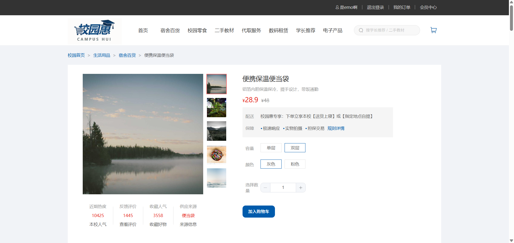
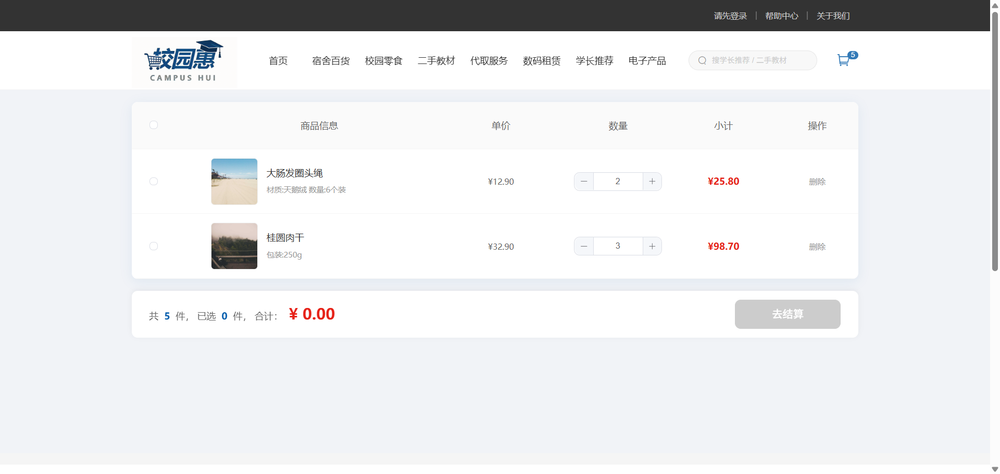
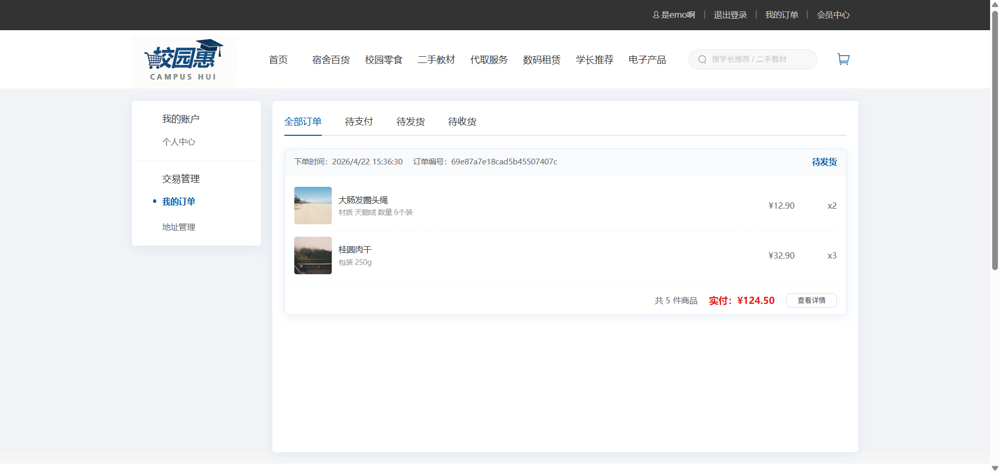

<h1 align="center">校园惠 Campus On Sale</h1>

<p align="center">
  <strong>面向校园场景的现代化二手交易平台 · 前端工程化实践</strong>
</p>

<p align="center">
  <a href="https://vuejs.org/"></a>
  <a href="https://vitejs.dev/"></a>
  <a href="https://element-plus.org/"></a>
  <a href="https://www.typescriptlang.org/"></a>
  <a href="https://expressjs.com/"></a>
  <a href="https://www.mongodb.com/"></a>
</p>

<p align="center">
  <a href="https://router.vuejs.org/"></a>
  <a href="https://pinia.vuejs.org/"></a>
  <a href="https://sass-lang.com/"></a>
  <a href="https://eslint.org/"></a>
  <a href="https://prettier.io/"></a>
  <a href="https://axios-http.com/"></a>
</p>

<p align="center">
  <a href="./docs/接口.md">📝 接口文档</a>
</p>

---

## 📖 项目简介

> **校园惠** 是一套前后端分离的校园二手电商应用。前端以 **Vue 3 + TypeScript + Vite** 构建，覆盖商品浏览、购物车与订单闭环；后端以 Express + MongoDB 提供 RESTful API。

> 🔥 **在线预览**：[点击访问校园惠 Demo](https://shop.emoa.tech)

---

## ⚡ 前端技术亮点一览

| 维度 | 实现方式 | 工程收益 |
| :--- | :------- | :------- |
| **路由权限** | `PROTECTED_PATHS` 白名单 + `beforeEach` 登录拦截；未登录携带 `redirect` 回跳，已登录访问登录页反向重定向；`ElLoading` + `scrollBehavior` 优化切换体验 | 深链访问不丢上下文，认证边界清晰，路由切换有明确加载反馈 |
| **状态管理** | Pinia 按域拆分 `user` / `cart` / `category`；`persist` 持久化会话与购物车；游客本地存储 + 登录后 `mergeCart()` 合并；总价/全选等由 `computed` 集中派生 | 刷新不丢态，登录前后购物车无缝衔接，视图层零重复计算 |
| **交互组件** | `ViewIndex` 基于 `@vueuse/core` `useMouseInElement` + `requestAnimationFrame` 实现放大镜；`AuthLayout` / `AddressForm` + `useAddress` 跨页复用 | 高频 `mousemove` 与渲染帧对齐，规避 Reflow；认证与地址逻辑一处维护 |
| **运行时性能** | 自定义 `v-img-lazy`（`IntersectionObserver` 单次解绑 + `unmounted` 释放）；购物车 300ms 防抖 + 结算前 `flushAllDebounced` | 列表按需加载图片；连续改量场景削减 **70%+** 无效请求与服务器压力 |
| **首屏与包体** | 路由 `() => import()` 懒加载；`manualChunks` 拆分 vue / element-plus / axios；Element Plus 按需引入 + SCSS 主题注入 | 首屏核心 Bundle 瘦身，vendor 与业务分离缓存，降低 FCP 解析压力 |
| **网络层** | Axios 自动注入 Token、业务码 `{ code, msg, result }` 解包；`401` 熔断 + `isRedirecting` 防重入跳转登录 | Token 失效统一清会话，杜绝半登录态下的请求风暴 |
| **工程化** | ESLint 9 Flat Config + Prettier；构建前 `vue-tsc --noEmit`；`app.config.errorHandler` 全局异常捕获；Vite 7 HMR + Mock | 类型与规范双重门禁，问题左移到开发/构建阶段 |

---

## 项目截图

### 首页


### 商品详情



### 购物车



### 个人中心



---

<details>
<summary><strong>🛠️ 技术选型与项目架构（点击展开）</strong></summary>

### 选型理由（前端）

| 技术 | 选型考量 |
| :--- | :------- |
| **Vue 3 + `<script setup>`** | Composition API 便于逻辑复用与类型推导，适合中等复杂度电商页面 |
| **TypeScript** | API 响应、Store、组件 Props 全链路类型约束，降低联调与重构成本 |
| **Vite 7** | 原生 ESM 开发与快速 HMR；生产构建基于 Rollup，便于配置分包策略 |
| **Pinia** | 轻量模块化 Store，与 TS 和持久化插件配合自然 |
| **Element Plus** | 成熟的表单、布局组件，缩短电商 UI 开发周期 |
| **SCSS** | 全局变量、混入与 Element 主题覆盖，统一设计令牌 |

### 整体架构

```
┌─────────────────────────────────────────────────────────────────┐
│                          Frontend                                │
│  ┌─────────────────────────────────────────────────────────┐   │
│  │                        Views                             │   │
│  │   Home │ Category │ Detail │ Cart │ Checkout │ Member   │   │
│  ├─────────────────────────────────────────────────────────┤   │
│  │                    Components                            │   │
│  │     ViewIndex │ AddressForm │ AuthLayout...             │   │
│  ├─────────────────────────────────────────────────────────┤   │
│  │              Composables │ Directives                   │   │
│  │         useAddress │ v-img-lazy                          │   │
│  ├─────────────────────────────────────────────────────────┤   │
│  │                      Stores                              │   │
│  │      userStore │ cartStore │ categoryStore               │   │
│  ├─────────────────────────────────────────────────────────┤   │
│  │                       APIs                               │   │
│  │            Axios + 请求/响应拦截器                       │   │
│  └─────────────────────────────────────────────────────────┘   │
└─────────────────────────────────────────────────────────────────┘
                              │
                              │ HTTP / RESTful API
                              ▼
┌─────────────────────────────────────────────────────────────────┐
│                          Backend                                 │
│  ┌─────────────────────────────────────────────────────────┐   │
│  │                     Routes                               │   │
│  │   user │ home │ category │ goods │ cart │ order │ address│  │
│  ├─────────────────────────────────────────────────────────┤   │
│  │                    Middleware                            │   │
│  │              CORS │ JSON Parser │ Auth                   │   │
│  ├─────────────────────────────────────────────────────────┤   │
│  │                     Models                               │   │
│  │      User │ Goods │ Category │ Cart │ Order │ Address    │   │
│  └─────────────────────────────────────────────────────────┘   │
└─────────────────────────────────────────────────────────────────┘
                              │
                              │ Mongoose ODM
                              ▼
                        ┌──────────┐
                        │ MongoDB  │
                        └──────────┘
```

### 前端目录结构

```
frontend/src/
├── apis/           # 按业务域拆分的 API 封装
├── components/     # 公共组件（ViewIndex、AddressForm、AuthLayout）
├── composables/    # 可复用组合式函数（useAddress 等）
├── constants/      # 全局常量（PROTECTED_PATHS、DEBOUNCE_DELAY）
├── directives/     # 自定义指令（v-img-lazy）
├── router/         # 路由配置与守卫
├── stores/         # Pinia 状态管理
├── styles/         # 全局样式 + Element Plus 主题
├── types/          # TypeScript 类型定义
├── utils/          # Axios 实例与拦截器
└── views/          # 页面组件
```

### 后端目录结构

```
backend/src/
├── config/         # 配置文件（数据库连接）
├── middleware/     # 中间件（JWT 认证）
├── models/         # Mongoose 数据模型
├── routes/         # API 路由
│   └── member/    # 需要认证的会员接口
└── seed/           # 数据库种子数据
```

</details>

<details>
<summary><strong>🚀 本地开发指南（点击展开）</strong></summary>

### 环境要求

- Node.js `^20.19.0` 或 `>=22.12.0`
- MongoDB `>=6.0`
- npm / yarn / pnpm

### 前端启动

```bash
cd frontend
npm install
npm run dev
```

访问 http://localhost:8080

### 后端启动

```bash
cd backend
npm install

# 配置环境变量
cp .env.example .env

# 初始化数据库（可选）
npm run seed

npm run dev
```

后端运行在 http://localhost:3000

</details>

<details>
<summary><strong>⚙️ 环境变量配置（点击展开）</strong></summary>

### 前端环境变量

在 `frontend/` 目录下创建 `.env.local` 文件：

```env
VITE_API_BASE_URL=http://localhost:3000
VITE_APP_TITLE=校园惠
```

| 变量                | 说明          | 开发环境                | 生产环境        |
| :------------------ | :------------ | :---------------------- | :-------------- |
| `VITE_API_BASE_URL` | 后端 API 地址 | `http://localhost:3000` | `/`（相对路径） |
| `VITE_APP_TITLE`    | 应用标题      | 校园惠                  | 校园惠          |

### 后端环境变量

在 `backend/` 目录下创建 `.env` 文件：

```env
PORT=3000
MONGODB_URI=mongodb://localhost:27017/campus
JWT_SECRET=your-jwt-secret-key
```

| 变量          | 说明             |
| :------------ | :--------------- |
| `PORT`        | 服务端口         |
| `MONGODB_URI` | MongoDB 连接地址 |
| `JWT_SECRET`  | JWT 密钥         |

</details>

<details>
<summary><strong>📋 常用命令（点击展开）</strong></summary>

### 前端命令

| 命令              | 说明                        |
| :---------------- | :-------------------------- |
| `npm run dev`     | 启动开发服务器（端口 8080） |
| `npm run build`   | 类型检查 + 生产环境构建     |
| `npm run preview` | 预览构建结果                |
| `npm run lint`    | ESLint 代码检查             |
| `npm run format`  | Prettier 格式化             |

### 后端命令

| 命令            | 说明                             |
| :-------------- | :------------------------------- |
| `npm run dev`   | 启动开发服务器（nodemon 热重载） |
| `npm run build` | 编译 TypeScript                  |
| `npm run start` | 启动生产服务器                   |
| `npm run seed`  | 初始化数据库种子                 |

</details>

<details>
<summary><strong>📦 部署说明（点击展开）</strong></summary>

### 前端构建

```bash
cd frontend
npm run build
```

构建产物位于 `frontend/dist/` 目录。

### 后端构建

```bash
cd backend
npm run build
```

编译产物位于 `backend/dist/` 目录。

</details>

### RESTful API 设计

```
公共接口
├── POST /login          # 用户登录
├── POST /register       # 用户注册
├── GET  /home           # 首页数据
├── GET  /category/:id   # 分类数据
└── GET  /goods/:id      # 商品详情

认证接口（需要 JWT Token）
├── /member/cart         # 购物车 CRUD
├── /member/order        # 订单管理
└── /member/address      # 地址管理
```

</details>

<details>
<summary><strong>📚 技术栈总览（点击展开）</strong></summary>

### 前端技术栈

| 技术         | 版本   | 说明                      |
| :----------- | :----- | :------------------------ |
| Vue          | 3.5.25 | 渐进式 JavaScript 框架    |
| Vite         | 7.2.4  | 下一代前端构建工具        |
| Vue Router   | 4.6.3  | Vue.js 官方路由管理器     |
| Pinia        | 3.0.4  | Vue.js 官方状态管理库     |
| Element Plus | 2.12.0 | 基于 Vue 3 的组件库       |
| Axios        | 1.13.2 | Promise based HTTP 客户端 |
| TypeScript   | 6.0.2  | JavaScript 的超集         |
| SCSS         | 1.94.2 | CSS 预处理器              |
| VueUse       | 14.1.0 | Composition 工具集        |

### 后端技术栈

| 技术     | 版本  | 说明                 |
| :------- | :---- | :------------------- |
| Express  | 5.2.1 | Node.js Web 应用框架 |
| MongoDB  | 9.4.1 | NoSQL 数据库         |
| Mongoose | 9.4.1 | MongoDB 对象建模工具 |
| JWT      | 9.0.3 | JSON Web Token 认证  |
| bcryptjs | 3.0.3 | 密码加密库           |

</details>

---

**如果这个项目对你有帮助，请给一个 ⭐ Star**

Made with ❤️
